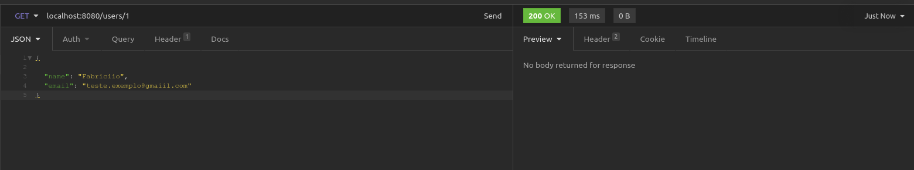

# Rabbitmq example

This project is a small example of implementation of rabbitmq, 
it contains 1 API and possibility to use 2 queue. Feel free to fork or clone.
# Development environment

### Requirements

+ OpenJDK 11 - https://openjdk.java.net/install
+ Apache Maven - https://maven.apache.org/install.html
+ Git - https://git-scm.com/downloads
+ Docker https://docs.docker.com/install
+ Docker Compose https://docs.docker.com/compose/install

### Running the project

1. To upload the docker-composer, enter the terminal: "**docker-compose up -d**"
2. Play in the project

### Request and Response

Url : localhost:8080/users/1
####Request:
~~~json
{
    "name": "Fabricio",
    "email": "test.exemplo@gmail.com"
}
~~~

####Response
status: 200

### Rabbitmq Console

Url: http://localhost:15672

User: admin

Password: 123456

### Test

#### Insomnia or postman
 Queue one

or

 Queue two

### Console Java

